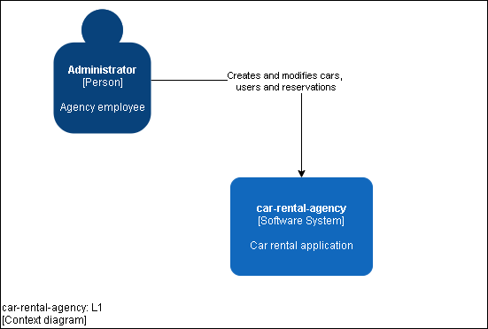
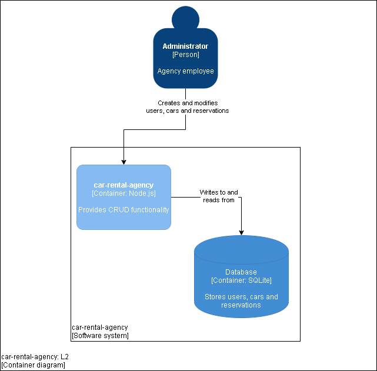
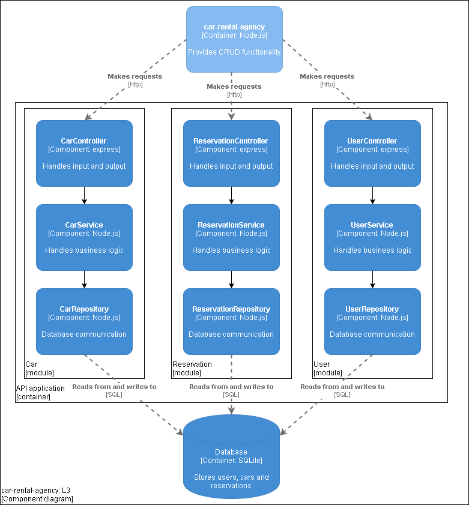

# Car rental agency

_Web application for a car rental agency_

## Tech stack
- Node.js
- Expres.js
- SQLite
- Sequelize
- Nunjucks

## Installation

Requirements:
- Node.js

Setting up development environment:
```
>git clone https://github.com/NovoaMartin/car-rental-agency
>npm install
>cp .env.dist .env   # edit the values
>npm run setup
>npm run dev
```

## C4 diagrams






